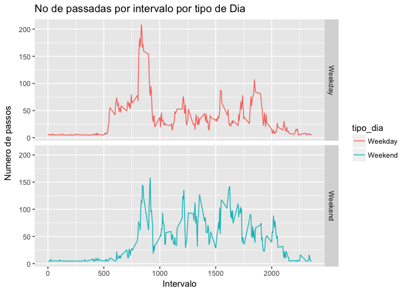

## Loading and preprocessing the data

* Load the libraries  
* Carregamento das bibliotecas  


```r
library(ggplot2)
library(dplyr)
library(data.table)
```

* Code for reading in the dataset and/or processing the data  
* Codigo para ler os dados e/ou processar as dados  


```r
data_na <- read.csv("activity.csv")
head(data_na)
```

```
##   steps       date interval
## 1    NA 2012-10-01        0
## 2    NA 2012-10-01        5
## 3    NA 2012-10-01       10
## 4    NA 2012-10-01       15
## 5    NA 2012-10-01       20
## 6    NA 2012-10-01       25
```


* Remocao dos valores nulos
* Remove NA values


```r
data <- na.omit(data_na)
head(data)
```

```
##     steps       date interval
## 289     0 2012-10-02        0
## 290     0 2012-10-02        5
## 291     0 2012-10-02       10
## 292     0 2012-10-02       15
## 293     0 2012-10-02       20
## 294     0 2012-10-02       25
```

## What is mean total number of steps taken per day?

* Filtro os dados para passos diarios
* Apply the filter of steps taken by day


```r
passos <- data %>%
        group_by(date) %>%
                summarise(steps = sum(steps))
```


* Obtemos a media de passos por dia
* obtain the mean of steps by day


```r
media <- mean(passos$steps)
paste("A media foi de: ", media, sep = " " )
```

```
## [1] "A media foi de:  10766.1886792453"
```

```r
paste("The mean is: ", media, sep = " " )
```

```
## [1] "The mean is:  10766.1886792453"
```

* Obtemos a mediana de passos por dia
* obtain the mean of steps by day


```r
mediana <- median(passos$steps)
paste("A mediana foi de: ", mediana, sep = " " )
```

```
## [1] "A mediana foi de:  10765"
```

```r
paste("The median is: ", mediana, sep = " " )
```

```
## [1] "The median is:  10765"
```


* Monto a plotagem dos dados
* Plot the data


```r
hist(passos$steps, xlab = "Passos", ylab = "Frequencia", main = "Number of steps taken each day (with mean - green line)", col = "pink")
#abline(v = media,  col="green", lwd=3, lty=3)
abline(v=c(media,mediana), col=c("green", "red"), lty=c(3,2), lwd=c(3, 3))
legend("topright", c("Mean", "Median"), fill=c("Green", "red"))
```

<!-- -->


## What is the average daily activity pattern?

* Fazemos um pipeline para obter a media de passadas por intervalos de data
* Make a pu=ipeline to obtain the average deily activity


```r
media_de_passadas <- data %>%
        group_by(interval) %>%
                summarise(steps = mean(steps))
```

* Plot the data
* Monto a plotagem dos dados


```r
plot(media_de_passadas$interval, media_de_passadas$steps, type="l", xlab="Intervalo", ylab="Passadas",main="Media Diaria de Passadas por Intervalo")
```

<!-- -->

* The maximum number of steps by interval
* O maior numero de passadas por intervalo


```r
maior_intervalo <- media_de_passadas[which.max(media_de_passadas$steps),1]
paste("O Maior numero de passadas ao longo do dia foi: ", maior_intervalo, sep = " ")
```

```
## [1] "O Maior numero de passadas ao longo do dia foi:  835"
```

```r
paste("The maximum number of steps by interval was: ", maior_intervalo, sep = " ")
```

```
## [1] "The maximum number of steps by interval was:  835"
```


## Imputing missing values

* Obtain the number of NAs
* Obtemos o numero de valores nulos

```r
size <- length(which(is.na(data_na$steps)))
paste("Numero de NAs: ", size, sep = " " )
```

```
## [1] "Numero de NAs:  2304"
```

```r
paste("Number of NAs: ", size, sep = " " )
```

```
## [1] "Number of NAs:  2304"
```

* Sunstitui-se os NAs pelo numero medio de passadas no dataset
* Replace NAS with the mean of steps without NAs in this dataset


```r
data_na$steps = ifelse(is.na(data_na$steps), mean(data_na$steps, na.rm = T), data_na$steps)
head(data_na)
```

```
##     steps       date interval
## 1 37.3826 2012-10-01        0
## 2 37.3826 2012-10-01        5
## 3 37.3826 2012-10-01       10
## 4 37.3826 2012-10-01       15
## 5 37.3826 2012-10-01       20
## 6 37.3826 2012-10-01       25
```

* Obtain the number of NAs
* Obtemos o numero de valores nulos

```r
size <- length(which(is.na(data_na$steps)))
paste("Numero de NAs: ", size, sep = " " )
```

```
## [1] "Numero de NAs:  0"
```

```r
paste("Number of NAs: ", size, sep = " " )
```

```
## [1] "Number of NAs:  0"
```


* Utilizo a funcao tapply para obtera soma de passos por data
* Use tapply function to obtain the sum of steps by day


```r
filtro <- tapply(data_na$steps, data_na$date, sum)
```

* Converto as datas para milesegundos
* Convert dates to mileseconds format


```r
data_na$date <- as.POSIXct(data_na$date)
```

```
## Warning in strptime(xx, f <- "%Y-%m-%d %H:%M:%OS", tz = tz): unknown
## timezone 'zone/tz/2017c.1.0/zoneinfo/America/Sao_Paulo'
```

* Crio a variavel mes e extrai seu valor do atributo date 
* Create the mes variable and obtain your value of date atribute


```r
data_na$mes <- as.numeric(format(data_na$date, "%m"))
```

* Media de passos por dia
* Avera of steps taken each day


```r
media_dia <- mean(filtro)
```

* Mediana de passos por dia
* Median of steps taken each day


```r
mediana_dia <- median(filtro)
```

* Crio o histrograma com o numero de passos por dia apos inserir os valores nulos tratados
* Create the histogram of number steps taken each day after treat de minning values


```r
hist(filtro, xlab = "Numero de Passos", ylab = "Frequencia", main = "Histograma com o numero total de passos por dia com NAs tratados", col = "#2073d4")
abline(v=c(media_dia,mediana_dia), col=c("green", "red"), lty=c(3,2), lwd=c(3, 3))
legend("topright", c("Mean", "Median"), fill=c("Green", "red"))
```

<!-- -->

## Are there differences in activity patterns between weekdays and weekends?


* Criamos a coluna dia com o dia da semama obtido do atributo date
* Create the dia column with the weekday obtained from de date attibute

```r
data_na$dia <- weekdays(data_na$date)
head(data_na)
```

```
##     steps       date interval mes    dia
## 1 37.3826 2012-10-01        0  10 Monday
## 2 37.3826 2012-10-01        5  10 Monday
## 3 37.3826 2012-10-01       10  10 Monday
## 4 37.3826 2012-10-01       15  10 Monday
## 5 37.3826 2012-10-01       20  10 Monday
## 6 37.3826 2012-10-01       25  10 Monday
```

* Aplicamos o filtro para criar as categorias 'weekend' e 'weekday'
* Apply filter to create the categories  'weekend' and 'weekday'
 *My computer is in portuguese PT_BR and the function weekdays can convert the weekdays to [segunda, terca, quarta, quinta...] instead [monday, tuesday, ....]. My option to solve this is include two modes of days to execurrute correct a function to obtain the classes weekend ou weekday

```r
data_na$tipo_dia <- ifelse(data_na$dia == "sabado" | data_na$dia == "domingo" | data_na$dia == "Saturday" | data_na$dia == "Sunday", "Weekend", "Weekday")
head(data_na)
```

```
##     steps       date interval mes    dia tipo_dia
## 1 37.3826 2012-10-01        0  10 Monday  Weekday
## 2 37.3826 2012-10-01        5  10 Monday  Weekday
## 3 37.3826 2012-10-01       10  10 Monday  Weekday
## 4 37.3826 2012-10-01       15  10 Monday  Weekday
## 5 37.3826 2012-10-01       20  10 Monday  Weekday
## 6 37.3826 2012-10-01       25  10 Monday  Weekday
```

* Converter a variavel tipo_dia para um tipo categorico
* Convert tipo_dia to factor variable

```r
data_na$tipo_dia <- as.factor(data_na$tipo_dia)
summary(data_na$tipo_dia)
```

```
## Weekday Weekend 
##   12960    4608
```


* Crio o dataframe medias_dias com as medias de passadas aos dias uteis e fins de semana
* Create a dataframe medias_dias with the average of the weekdays and weekend


```r
medias_dias <- data_na %>%
                      group_by(tipo_dia,interval) %>%
                      summarise(steps = mean(steps))
medias_dias
```

```
## # A tibble: 576 x 3
## # Groups:   tipo_dia [?]
##    tipo_dia interval steps
##    <fct>       <int> <dbl>
##  1 Weekday         0  7.01
##  2 Weekday         5  5.38
##  3 Weekday        10  5.14
##  4 Weekday        15  5.16
##  5 Weekday        20  5.07
##  6 Weekday        25  6.30
##  7 Weekday        30  5.61
##  8 Weekday        35  6.01
##  9 Weekday        40  4.98
## 10 Weekday        45  6.58
## # ... with 566 more rows
```

* Plotagem dos dados medios para dias uteis e fins de semana
* Plot data average of weekdays and weekend


```r
ggplot(data = medias_dias, aes(x = interval, y = steps)) +
  facet_grid(tipo_dia ~ .) +
  geom_line(stat = "identity", aes(colour = tipo_dia)) +
  ggtitle("Dias Uteis x Fim de Semana (Media de Passadas)") +
  labs(x="Intervalo", y=expression("Numero de passos"))
```

<!-- -->

## Alternative Mode
* Primeiro criamos dataFrames para dias uteis e fins de semana
* First create a weekdays and weekend dataFrames


```r
weekday_db <- medias_dias[medias_dias$tipo_dia == "Weekday", ]
weekday_db
```

```
## # A tibble: 288 x 3
## # Groups:   tipo_dia [1]
##    tipo_dia interval steps
##    <fct>       <int> <dbl>
##  1 Weekday         0  7.01
##  2 Weekday         5  5.38
##  3 Weekday        10  5.14
##  4 Weekday        15  5.16
##  5 Weekday        20  5.07
##  6 Weekday        25  6.30
##  7 Weekday        30  5.61
##  8 Weekday        35  6.01
##  9 Weekday        40  4.98
## 10 Weekday        45  6.58
## # ... with 278 more rows
```

```r
weekend_db <- medias_dias[medias_dias$tipo_dia == "Weekend", ]
weekend_db
```

```
## # A tibble: 288 x 3
## # Groups:   tipo_dia [1]
##    tipo_dia interval steps
##    <fct>       <int> <dbl>
##  1 Weekend         0  4.67
##  2 Weekend         5  4.67
##  3 Weekend        10  4.67
##  4 Weekend        15  4.67
##  5 Weekend        20  4.67
##  6 Weekend        25  7.92
##  7 Weekend        30  4.67
##  8 Weekend        35  4.67
##  9 Weekend        40  4.67
## 10 Weekend        45  5.05
## # ... with 278 more rows
```
* Criamos as plotagens dos dois dataFrames
* Create the plots of dataFrames

```r
data_weekdays<- ggplot(weekday_db) +
        geom_line(aes(x = interval, y = steps), colour = "red", linetype = "dashed") +
    xlab("Intervalos de Dias Uteis") +
    ylab("Passsos")

data_weekends <- ggplot(weekend_db) +
        geom_line(aes(x = interval, y = steps), colour = "blue", linetype = "dotted") +
  xlab("Intervalos de Fins de Semana") +
  ylab("Passsos")
```

* Instalamos e Carregamos a biblioteca para criar grid de plotagens
* Install and load the library to create a plot grid

```r
#install.packages('gridExtra')
library(gridExtra)
```

```
## 
## Attaching package: 'gridExtra'
```

```
## The following object is masked from 'package:dplyr':
## 
##     combine
```
* Exibimos o grid criado
* Displays a created grid


```r
grid.arrange(data_weekdays,data_weekends,  ncol=1, top = "Dias Uteis x Fim de Semana (Media de Passadas)", left = "Y", bottom = "X")
```

<!-- -->


