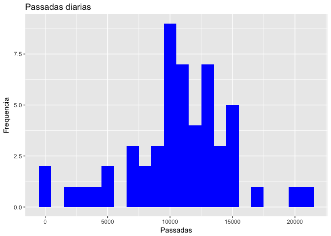
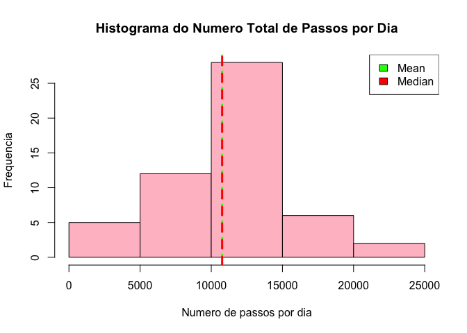

## Loading and preprocessing the data

Carrego as bibliotecas  


```r
library(ggplot2)
library(dplyr)
```

Inicialmente farei a carga dos dados e os verifico  


```r
data_na <- read.csv("activity.csv")
head(data_na)
```

```
##   steps       date interval
## 1    NA 2012-10-01        0
## 2    NA 2012-10-01        5
## 3    NA 2012-10-01       10
## 4    NA 2012-10-01       15
## 5    NA 2012-10-01       20
## 6    NA 2012-10-01       25
```


Agora elimino os valores nulos e verifico 


```r
data <- na.omit(data_na)
head(data)
```

```
##     steps       date interval
## 289     0 2012-10-02        0
## 290     0 2012-10-02        5
## 291     0 2012-10-02       10
## 292     0 2012-10-02       15
## 293     0 2012-10-02       20
## 294     0 2012-10-02       25
```

## What is mean total number of steps taken per day?
Filtro os dados para passosik diarios


```r
passos <- data %>%
  group_by(date) %>%
  summarise(steps = sum(steps))
```

Monto a plotagem dos dados  


<!-- -->

Obtemos a media


```r
media <- mean(passos$steps)
paste("A media foi de: ", media, sep = " " )
```

```
## [1] "A media foi de:  10766.1886792453"
```

Obtemos a mediana


```r
mediana <- median(passos$steps)
paste("A mediana foi de: ", mediana, sep = " " )
```

```
## [1] "A mediana foi de:  10765"
```


## What is the average daily activity pattern?


```r
media_de_passadas <- data %>%
  group_by(interval) %>%
  summarise(steps = mean(steps))


plot(media_de_passadas$interval, media_de_passadas$steps, type="l", xlab="Intervalo", ylab="Passadas",main="Media Diaria de Passadas por Intervalo")
```

<!-- -->


```r
maior_intervalo <- media_de_passadas[which.max(media_de_passadas$steps),1]
paste("O Maior numero de passadas ao longo do dia foi: ", maior_intervalo, sep = " ")
```

```
## [1] "O Maior numero de passadas ao longo do dia foi:  835"
```


## Imputing missing values


```r
size <- length(which(is.na(data_na$steps)))
paste("Numero de NAs: ", size, sep = " " )
```

```
## [1] "Numero de NAs:  2304"
```


```r
data_na$steps = ifelse(is.na(data_na$steps), mean(data_na$steps, na.rm = T), data_na$steps)
head(data_na)
```

```
##     steps       date interval
## 1 37.3826 2012-10-01        0
## 2 37.3826 2012-10-01        5
## 3 37.3826 2012-10-01       10
## 4 37.3826 2012-10-01       15
## 5 37.3826 2012-10-01       20
## 6 37.3826 2012-10-01       25
```


```r
size <- length(which(is.na(data_na$steps)))
paste("Numero de NAs: ", size, sep = " " )
```

```
## [1] "Numero de NAs:  0"
```


```r
atividades <- data_na %>%
                group_by(interval) %>%
                  mutate(steps = replace(steps, is.na(steps), mean(steps, na.rm = TRUE))) %>%
                      group_by(date) %>%
                      summarise(steps = sum(steps))
head(atividades)
```

```
## # A tibble: 6 x 2
##   date       steps
##   <fct>      <dbl>
## 1 2012-10-01 10766
## 2 2012-10-02   126
## 3 2012-10-03 11352
## 4 2012-10-04 12116
## 5 2012-10-05 13294
## 6 2012-10-06 15420
```


```r
filtro <- tapply(data_na$steps, data_na$date, sum)
qplot(filtro, xlab='Total steps per day (Imputed)', ylab='Frequency using binwith 500', binwidth=500)
```

<!-- -->


```r
data_na$date <- as.POSIXct(data_na$date)
```

```
## Warning in strptime(xx, f <- "%Y-%m-%d %H:%M:%OS", tz = tz): unknown
## timezone 'zone/tz/2017c.1.0/zoneinfo/America/Sao_Paulo'
```

```r
data_na$mes <- as.numeric(format(data_na$date, "%m"))
ggplot(data_na, aes(date, steps)) + 
  facet_grid(. ~ mes, scales = "free") + 
  geom_bar(stat = "identity", position = "stack", colour = "blue", fill = "red", width = 0.5) + 
  labs(title = "Numero Total de passos dados a cada dia - Considerando NAs com a m??dia", x = "Data", y = "Numero de Passos")
```

<!-- -->


```r
mean(data_na$steps)
```

```
## [1] 37.3826
```


## Are there differences in activity patterns between weekdays and weekends?


```r
library(data.table)
```

```
## 
## Attaching package: 'data.table'
```

```
## The following objects are masked from 'package:dplyr':
## 
##     between, first, last
```

```r
data_na <- as.data.table(data_na)
data_na$dia <- weekdays(data_na$date)
#head(data_na)
data_na$modo <- ifelse(data_na$dia == "sabado" | data_na$dia == "domingo" | data_na$dia == "Saturday" | data_na$dia == "Sunday", "Weekend", "Weekday")
head(data_na)
```

```
##      steps       date interval mes    dia    modo
## 1: 37.3826 2012-10-01        0  10 Monday Weekday
## 2: 37.3826 2012-10-01        5  10 Monday Weekday
## 3: 37.3826 2012-10-01       10  10 Monday Weekday
## 4: 37.3826 2012-10-01       15  10 Monday Weekday
## 5: 37.3826 2012-10-01       20  10 Monday Weekday
## 6: 37.3826 2012-10-01       25  10 Monday Weekday
```

```r
data_na$modo <- as.factor(data_na$modo)
summary(data_na$modo)
```

```
## Weekday Weekend 
##   12960    4608
```


```r
medias_dias <- data_na %>%
                      group_by(modo,interval) %>%
                      summarise(steps = mean(steps))
medias_dias
```

```
## # A tibble: 576 x 3
## # Groups:   modo [?]
##    modo    interval steps
##    <fct>      <int> <dbl>
##  1 Weekday        0  7.01
##  2 Weekday        5  5.38
##  3 Weekday       10  5.14
##  4 Weekday       15  5.16
##  5 Weekday       20  5.07
##  6 Weekday       25  6.30
##  7 Weekday       30  5.61
##  8 Weekday       35  6.01
##  9 Weekday       40  4.98
## 10 Weekday       45  6.58
## # ... with 566 more rows
```


```r
ggplot(data = medias_dias, aes(x = interval, y = steps))+
  facet_grid(modo ~ .)+
  geom_line()+
  ggtitle("Weekday vs. Weekend (Avg. Steps)")
```

<!-- -->


